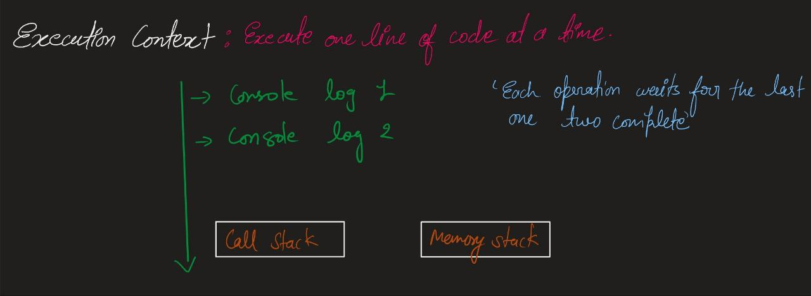
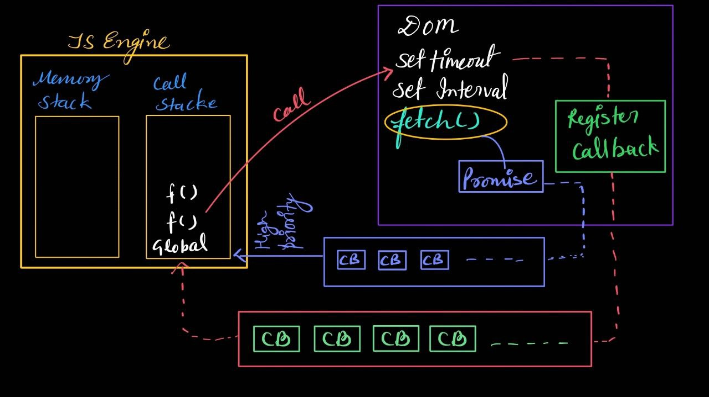

# Java Asychronous Code

JavaScript is a single-threaded, synchronous programming language by default.

Since JavaScript is single-threaded and synchronous by default, it can be slower compared to some other languages.
 
However, it never feels that way to the user because of its amazing features, which we’ll discuss later.

This default behavior can be observed when JavaScript runs alone, like in a standalone environment. But JavaScript usually runs inside a browser, where it's supported by a runtime environment that includes extra tools. Because of this, it doesn't feel slow, synchronous, or single-threaded to the user.

All of this is about JavaScript’s default behavior. 

Now, let’s understand what ‘Execution Context’ means. In JavaScript, execution context means that each operation waits for the previous one to finish before it runs.

## Blocking code vs Non-Blocking Code

Blocking code blocks the flow of code execution while non-blocking code doesn't block the flow of the code execution. 

Blocking code halts the flow of code execution until a particular task is completed, whereas non-blocking code allows the execution to continue without waiting for the task to finish.

Real-world analogy:
Imagine you're using your phone and ask me to bring a glass of water.

* If I say, "Stop using your phone until I return with the water," that's blocking—your activity is paused until the task is done.

* But if I say, "Keep using your phone while I get the water," that’s non-blocking—you continue your activity while I handle the task in the background.

Now, one might think that non-blocking code is always more efficient — but that’s not necessarily true. It really depends on the use case.

Take this example: You want to send a notification after a user successfully registers. If the code that stores the user’s details in the database runs non-blocking, the notification might be sent before the database confirms the data was saved. That would be misleading.

In such cases, it’s better to use blocking execution to ensure one task is fully completed before the next begins.

So, always choose between blocking and non-blocking based on the logical flow and reliability requirements of your application.

Now, let's see how this all happens in javascript engine. 

 

In the above diagram, we can see two stacks in the JS Engine: the memory stack and the call stack. Generally, this is how the JS Engine is represented, but in real execution environments like Node.js, browsers, or Deno, the JS Engine works within a broader system that includes other components.

Now, as we can see, when we use setTimeout() or setInterval(), they are not executed immediately. Instead, they are registered as callbacks and stored in a queue. This means the main execution continues while the delayed process waits for a few seconds before being pushed back into the call stack for execution.

In JavaScript, we also have the fetch() API, which works differently. Instead of going into the normal callback queue, it returns a Promise and places its callback in a higher priority queue called the Microtask Queue. This ensures that fetch() responses are handled before other callbacks, making it more efficient for handling asynchronous tasks.

This is how JavaScript manages non-blocking execution, ensuring tasks run efficiently without stopping the main thread. 